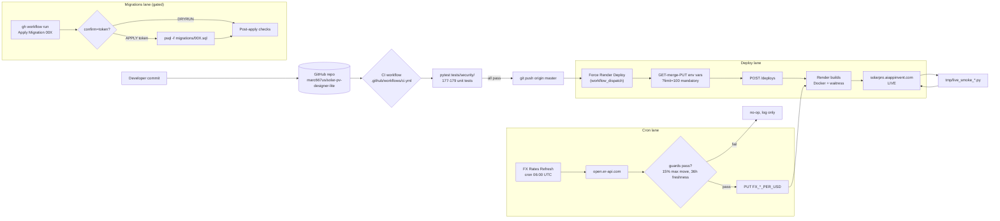

# CI/CD Pipeline

Last revised: 2026-06-25

## Workflow gating policy (per `feedback_workflow_dry_run_gate.md`)

Every UPDATE / DELETE / DDL workflow MUST:

1. Default to dry-run on `workflow_dispatch`.
2. Take a `confirm` input that must equal a specific token to commit.
3. Print a clear "would have done X" preview when in dry-run.
4. Print verification queries post-apply when in apply mode.

Workflows that follow this pattern today: `apply-keycloak-migrations`, `apply-migration-005-phase-b`, `apply-migration-007-boq-rls`, `paystack-rotate-to-live`, `cutover-to-keycloak`, `rollback-from-keycloak`, `fx-rates-refresh`.

## Test suites

| Suite | Where | When | What |
|---|---|---|---|
| Unit | `tests/security/` | every commit (local) | 179 tests, decorators + tenant ctx + OIDC routes + audit |
| Live smoke | `tmp/live_smoke_*.py` | after every deploy | M1.1 + SOC 2 routes + FX stamp + logout |
| Phase B smoke | `tmp/smoke_keycloak_pilot.py` | quarterly | full KC token-exchange path |
