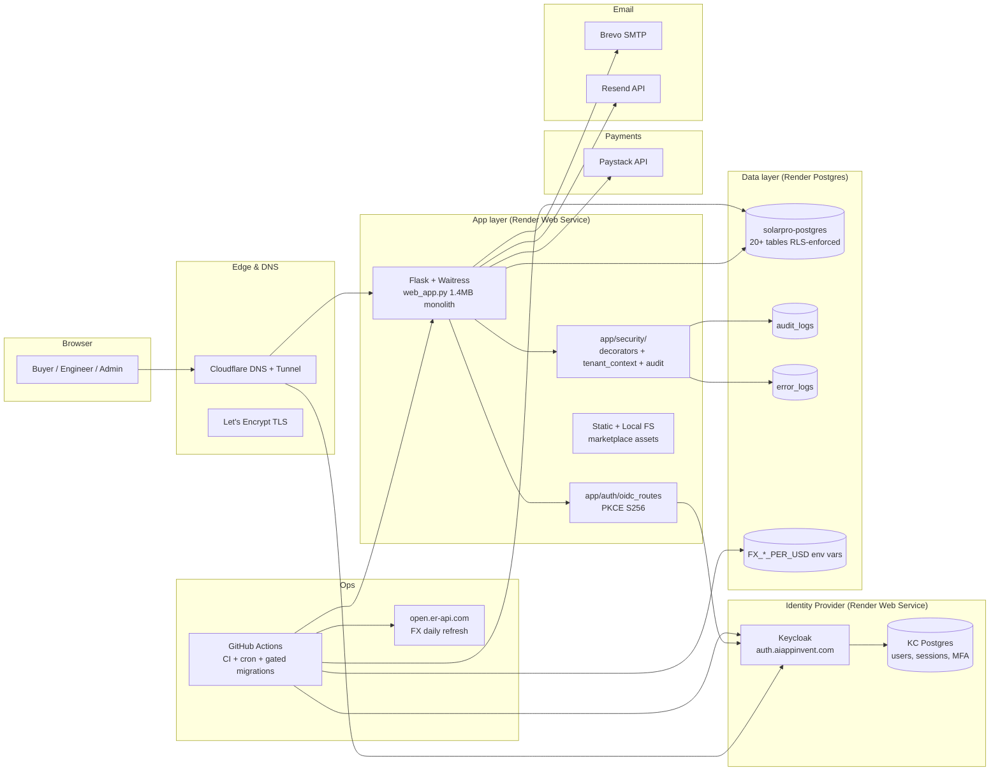

# Logical Architecture

Last revised: 2026-06-25

## Component ownership

| Component | Owner | Backed by |
|---|---|---|
| Flask app | Eng | Render Web Service (free tier) |
| Keycloak | Eng | Render Web Service + KC Postgres |
| solarpro-postgres | Eng | Render Postgres |
| Paystack / Brevo / Resend | Vendor | 3rd party |
| Cloudflare DNS | Ops | Cloudflare account |
| GitHub Actions | Eng | Repo CI runner |
