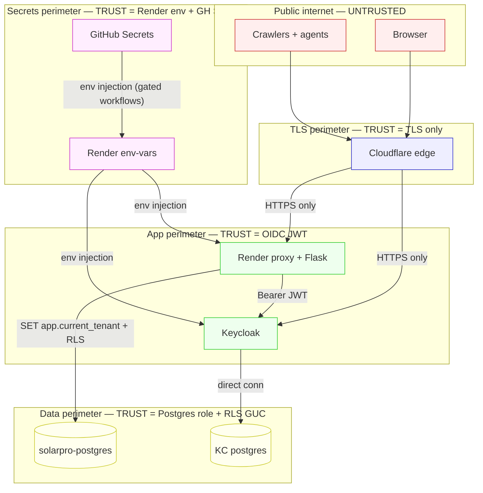

# Network Trust Boundaries

Last revised: 2026-06-25

## Trust boundary rules

| Boundary | What crosses | How it's enforced |
|---|---|---|
| Public → TLS | HTTP request | TLS termination at Cloudflare |
| TLS → App | HTTPS request | TLS-only ingress, no plain HTTP |
| App → IDP | OIDC flow + Bearer JWT validation | PKCE S256 + JWKS signature check (`app/security/keycloak_middleware.py`) |
| App → Data | DB query | `set_config('app.current_tenant', …)` + RLS policies on every tenant-owned table |
| Secrets → App | env-var injection only | Render env-vars API (gated workflows); no plaintext in repo |
| GH Secrets → Render | one-shot push via workflow | `apply-*-migrations.yml` + `Force Render Deploy` (uses `?limit=100` since 2026-06-22 incident) |

## Known footguns

- `Render Force Render Deploy` does a `PUT /env-vars` over the full list — `?limit=100` is **required** or KC vars get truncated (root cause of 2026-06-22 KC outage).
- Cloudflare free tunnel caps a single request at 100s — long admin actions return 524 even when the backend succeeds.
- Render free tier sleeps after 15min of inactivity → first request after sleep adds ~30s cold start.
