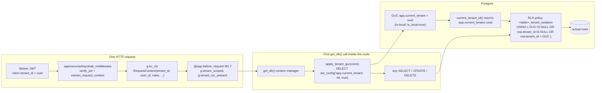
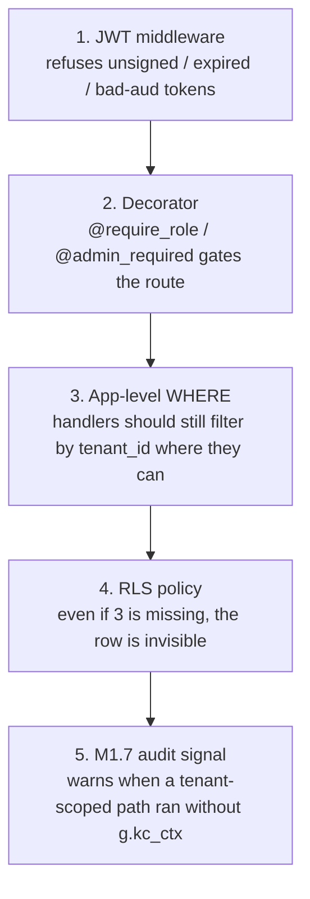

# RLS Data Layer

Last revised: 2026-06-25 (M1.6 BOQ-hierarchy batch applied)

How a tenant claim on the JWT becomes a Postgres `WHERE tenant_id = …` predicate.



## Defence in depth



## Parallel-run NULL escapes (current state)

The RLS policies created in migrations 003 + 007 carry two NULL escapes:

```sql
USING (
  current_tenant_id() IS NULL    -- GUC unset (no JWT context) -> visible
  OR tenant_id IS NULL            -- legacy row (pre-backfill) -> visible
  OR tenant_id = current_tenant_id()
)
```

Both escapes are intentional during the parallel-run phase. **Phase 7 cutover migration** (scheduled separately, post Phase B) tightens to `FORCE ROW LEVEL SECURITY` + drops both NULL escapes — at which point any request without `g.kc_ctx` will see zero rows on any tenant table.

## Tables under RLS today

| Migration | Tables |
|---|---|
| 003 (Phase 4) | projects, tickets, ticket_replies, email_logs, password_reset_tokens, payments, suppliers, equipment_catalog, rfqs, rfq_items, marketplace_boms, marketplace_bom_items, marketplace_boqs, marketplace_boq_items, price_sheets, price_sheet_items, marketplace_audit |
| 004 (audit log) | audit_logs |
| 007 (M1.6 BOQ batch) | boq_projects, boq_buildings, boq_floors, boq_floor_items, boq_floor_rate_buildup, boq_audit_log |
